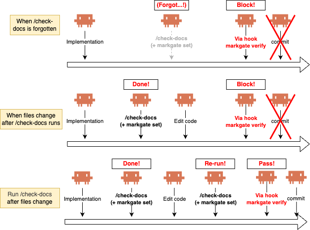
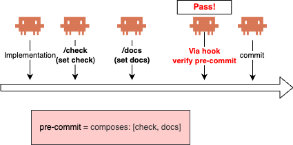

# markgate

`markgate` mechanically enforces any required task on AI coding
agents — skip **duplicate work** the agent already ran, enforce
**non-command tasks** (LLM review, manual sign-off), and aggregate
**multi-task verdicts** into one.

## Why this exists

Hooks have three failure modes when you want an AI coding agent to
reliably run a required task — a check (lint, test, build), an
LLM-judged review, a code-generation step, or any operation with a
pass/fail outcome. markgate addresses each with one of two primitives
— `markgate run` (one-shot) or `markgate set` + `markgate verify`
(the Gate pattern).

### 1. Duplicate execution: the hook re-runs a check the agent already ran

You tell your coding agent to run `/check` (test, lint, build, doc
consistency) before committing. **Sometimes it forgets** — context
loss, token pressure, hurry — and commits anyway.


So you add a pre-commit hook to enforce the check. Now every commit
runs the check twice, once by the agent, once by the hook. Heavy
checks slow the dev loop; light ones still add up.


Pulling the check out of the agent and leaving it only in the hook
isn't the answer — you can't run it before you're ready to commit.
Per-edit hooks aren't either — they pay the cost on every edit.

`markgate run` resolves the dilemma: keeping both the check site and
the hook in place, **the hook re-runs the check only when the agent
forgot**. When the agent ran the check properly, **the hook becomes
a near-instant no-op** — no duplicate execution.


Adoption is one line — prefix your check command:

```diff
- pnpm build
+ markgate run -- pnpm build
```

Drop the same line into the hook, and you're done.

### 2. Non-command enforcement: the hook can't run the task itself

Some tasks aren't commands. "Are these docs still consistent with
the code?" "Did a reviewer sign off on this diff?" An LLM can judge
them; a human can sign them off — a hook can't execute either. So
even when the agent is supposed to do the task, the hook has no
grip on whether it actually happened.

`markgate set` + `markgate verify` give the hook a grip by splitting
the run. The task — wherever it naturally lives, like a
`/check-docs` skill or a manual sign-off script — ends with
`markgate set` to record the pass. The hook calls `markgate verify`
to read the marker. The hook still can't run the task itself, but
it can **refuse to proceed unless the marker confirms it ran**.



Adoption is one line on each side:

```sh
# At the check site (skill body, sign-off script, ...):
markgate set

# In the hook:
markgate verify || { echo "Run /check-docs before committing." >&2; exit 1; }
```

### 3. Scope leak: tasks fire when unrelated files change, and the hook grows with each new task

As tasks accumulate — code check on `src/**`, docs review on
`docs/**`, vuln scan on `package-lock.json` — you want each one to
**fire only when its own files change**. The default whole-repo
hash doesn't allow that: a code-only edit invalidates the docs
marker, a docs-only edit invalidates the vuln-scan marker, so the
hook re-fires tasks that nothing relevant moved. And lining up N
`markgate verify` calls in the hook clutters the config in
proportion to how many tasks you add.

With `.markgate.yml`, each task gets its own **scoped gate** (its
own `include` globs), and the hook verifies a **parent gate** that
ANDs them all via `composes:`. The code check fires when `src/**`
moves; the docs review fires when `docs/**` moves. Edits outside
every scope (CI config, editor settings) invalidate nothing — the
hook stays silent.

```yaml
# .markgate.yml
gates:
  check:
    hash: files
    include: ["src/**", "tests/**"]
  docs:
    hash: files
    include: ["src/**", "docs/**", "README.md"]
  pre-commit:
    composes: [check, docs]
```



Adoption:

```sh
# Each task freshens its own marker, wherever it lives:
pnpm build && markgate set check
./scripts/check-docs && markgate set docs

# One verify in the hook covers both:
markgate verify pre-commit || { markgate status pre-commit >&2; exit 1; }
```

## Install

> **Note:** `markgate` is meant to run inside a git repository.

### Homebrew (macOS / Linux)

```sh
brew install go-to-k/tap/markgate
```

### Shell script (macOS / Linux / Windows with Git Bash)

```sh
# Latest
curl -fsSL https://raw.githubusercontent.com/go-to-k/markgate/main/install.sh | bash

# Pin a version
curl -fsSL https://raw.githubusercontent.com/go-to-k/markgate/main/install.sh | bash -s -- v0.1.0
```

### mise

Pin a version per repo via [`.mise.toml`](https://mise.jdx.dev/configuration.html):

```toml
[tools]
"ubi:go-to-k/markgate" = "0.2.0"
```

Or one-shot:

```sh
mise use "ubi:go-to-k/markgate@0.2.0"
```

### `go install`

```sh
go install github.com/go-to-k/markgate/cmd/markgate@latest
```

### Prebuilt binaries

Linux / macOS / Windows archives (amd64 / arm64 / 386) — see
[GitHub Releases](https://github.com/go-to-k/markgate/releases).

## Setup

For each of the three patterns from [Why this exists](#why-this-exists),
here's the minimum shape to wire it up. Pick the pattern that matches
your problem; the patterns are independent.

### Pattern 1: skip duplicate runs (`markgate run`)

Prefix the check command with `markgate run --` in **both** the place
that runs it and the hook that enforces it — the same one line goes
in both spots.

In your check site (a `/check` skill, build script, Make target, …):

```diff
- pnpm build
+ markgate run -- pnpm build
```

In your Claude Code `PreToolUse` hook on `git commit*`:

```diff
// .claude/settings.json
{
  "hooks": {
    "PreToolUse": [
      {
        "matcher": "Bash",
        "if": "Bash(git commit*)",
        "hooks": [
-         { "type": "command", "command": "pnpm build" }
+         { "type": "command", "command": "markgate run -- pnpm build" }
        ]
      }
    ]
  }
}
```

For other hook managers (husky, lefthook, pre-commit framework), the
shape is identical — see [Drop into your hook manager](#drop-into-your-hook-manager).

### Pattern 2: enforce non-command tasks (`set` + `verify`)

Hooks can only execute commands, so on their own they enforce only
**mechanical** tasks (lint, tests, build). Anything else — an LLM
judgment ("are these docs still in sync with what the code does?")
or a manual sign-off — can't be reduced to a command. Without
markgate, hooks have no way to gate on these.

markgate gives the hook a grip. The skill that performs the task
ends in `markgate set`; the hook runs `markgate verify`. When the
agent forgets to run the skill, the marker is missing or stale,
the hook blocks, and the agent is pointed back at the skill.

```sh
# At the end of /check-docs (Claude Code skill body):
markgate set

# In a pre-commit hook (.claude/settings.json, PreToolUse on git commit*):
markgate verify || { echo "Run /check-docs before committing." >&2; exit 1; }
```

### Pattern 3: scope each task to its files, aggregate the verdict (`.markgate.yml` + `composes`)

When tasks accumulate, drop a `.markgate.yml` at the repo root
(`markgate init` writes one). Two primitives stack:

- **Scoped gates** — each task gets its own `hash: files` +
  `include` globs, so it fires only when its own files change
- **Composes** — a parent gate ANDs the freshness of its children,
  so the hook calls one `verify` regardless of how many tasks

```yaml
# .markgate.yml
gates:
  check:
    hash: files
    include: ["src/**", "tests/**"]
  docs:
    hash: files
    include: ["src/**", "docs/**", "README.md"]

  pre-commit:
    composes: [check, docs]
```

```sh
# Each task freshens its own marker as it finishes:
pnpm typecheck && pnpm lint && pnpm build && markgate set check
./scripts/check-docs && markgate set docs

# One verify in the pre-commit hook covers both:
markgate verify pre-commit || { markgate status pre-commit >&2; exit 1; }
```

`markgate run` can't write an aggregate gate: `run` executes a single
command, and an aggregate gate has none. **Aggregate verify is
split-only.**

See [Use case 5](#5-pre-commit-collapse-multiple-scoped-gates-into-one-verify-composes)
for the invalidation matrix and a real-world wire-up, and
[Gate dependencies](#gate-dependencies-composes-vs-requires) for the
strict variant (`requires`) that refuses `set` on a stale child.

## How it works

When `markgate run -- <cmd>` is invoked:

1. It computes a **hash** of the current repo state.
2. If a saved marker matches, `<cmd>` is skipped (exit 0
   immediately).
3. Otherwise `<cmd>` runs. On success, the hash is saved as the new
   marker. On failure, the marker is left untouched.

(For the split shape, `markgate set` writes step 3's marker;
`markgate verify` does step 2's match check.)

```sh
# First run — nothing cached yet, so `pnpm build` runs and the pass is cached.
$ markgate run -- pnpm build
building...
passed in 7.2s

# Second run — nothing changed since the last success: instant skip.
$ markgate run -- pnpm build

# After you edit a file — cache is stale, `pnpm build` runs again.
$ echo '// fix typo' >> src/foo.ts
$ markgate run -- pnpm build
building...
passed in 7.1s
```

The marker is a small JSON file under `.git/markgate/`, one per
gate (the file name matches the gate name, e.g. `default.json`).
Not committed, not tracked, isolated per worktree. With
`--state-dir <dir>`, `MARKGATE_STATE_DIR=<dir>`, or `state_dir:`
in `.markgate.yml`, markers go to `<dir>/` instead — see [Sharing
markers](#sharing-markers-across-machines-ci--teammates). The
on-disk JSON layout is an implementation detail; don't parse it.

## `.markgate.yml` reference

Lives at `$(git rev-parse --show-toplevel)/.markgate.yml` (no
parent-dir walking).

`markgate init` writes a starter file at the repo root:

```sh
markgate init          # writes .markgate.yml at the repo root
markgate init --force  # overwrite an existing one
```

The generated file enables the `default` gate with `git-tree` hash,
plus commented-out examples (an `exclude` list on `git-tree` and a
`files`-type gate) — uncomment what you need.

Per-gate fields:

| field | purpose |
| --- | --- |
| `hash` | `git-tree` (default) or `files` |
| `include` | glob list; required for `hash: files` |
| `exclude` | glob list |
| `state_dir` | optional override of marker storage location — see [Sharing markers](#sharing-markers-across-machines-ci--teammates) |
| `ttl` | optional wall-clock expiry for the marker — see [Wall-clock expiry (`ttl`)](#wall-clock-expiry-ttl) |
| `composes` | child gate keys whose freshness is ANDed into this one — see [Gate dependencies](#gate-dependencies-composes-vs-requires) |
| `requires` | like `composes`, but `set` of this gate is refused unless every required child is fresh — see [Gate dependencies](#gate-dependencies-composes-vs-requires) |

Example:

```yaml
gates:
  default:
    hash: git-tree
    exclude:
      - "vendor/**"
      - "node_modules/**"

  pre-pr:
    hash: files
    include:
      - "docs/**"
      - "README.md"
    exclude:
      - "**/*.txt"
```

Each gate's key (the YAML map key — `default`, `pre-pr` above) must
match `[a-z0-9][a-z0-9-]*` (kebab-case ASCII). `default` is what
`markgate set` / `verify` use when no key argument is given:

```sh
markgate set               # same as `markgate set default`
markgate set pre-pr        # a second, independent gate
```

### Hashing strategies: `git-tree` vs `files`

The `hash` field above picks one of two strategies:

| aspect | `git-tree` (default) | `files` |
| --- | --- | --- |
| What it hashes | `HEAD` + diff-vs-HEAD ∪ untracked-not-ignored | whatever matches your `include` globs |
| `HEAD` in the hash? | **Yes** | **No** |
| Commits invalidate the marker? | Yes | Only if they touch in-scope files |
| `.gitignore` respected? | Yes (automatic) | No — scope is explicit |
| Needs config? | No | Yes (`include` required) |

When to use which:

- **`git-tree`** = "re-verify on *any* repo change". Broad gates
  (pre-commit running lint/test/build). Add `exclude` patterns to
  skip `vendor/`, `node_modules/`, etc. — HEAD-aware invalidation
  is kept.
- **`files`** = "re-verify *only* when these paths change, ignore
  other commits". Narrow gates (docs consistency, vuln scan rooted
  on a lockfile, coverage for one sub-tree).

Rule of thumb: start with `git-tree` (add `exclude` if needed).
Reach for `files` only when you specifically want the "ignore
commits that don't touch these paths" semantics.

## Use cases

Each section follows the same shape: **Scope** (what triggers
re-verify — a [`hash`](#hashing-strategies-git-tree-vs-files)
strategy) → **Commands** (what goes in your shell / hook). All
examples below use scoped `files`-hash gates defined in
[`.markgate.yml`](#markgateyml-reference) at the repo root, and the
[`set` + `verify` shape](#pattern-2-enforce-non-command-tasks-set--verify)
above. (For the broad whole-repo `git-tree` shape with no config,
see [Pattern 1](#pattern-1-skip-duplicate-runs-markgate-run).)

### 1. Pre-PR: docs consistency

**Scope**: only `docs/` and `README.md`. Code-only commits don't
invalidate the marker.

```yaml
# .markgate.yml
gates:
  pre-pr:
    hash: files
    include:
      - "docs/**"
      - "README.md"
```

**Commands**:

```sh
./scripts/check-docs && markgate set pre-pr

# Before `gh pr create`:
markgate verify pre-pr || {
  echo "Docs are out of date. Run check-docs." >&2
  exit 1
}
```

### 2. Pre-image-push: vulnerability scan freshness

**Scope**: only files that actually affect the image (Dockerfile +
lockfiles).

```yaml
gates:
  pre-image-push:
    hash: files
    include:
      - "Dockerfile"
      - "package.json"
      - "package-lock.json"
```

**Commands**:

```sh
trivy image ... && markgate set pre-image-push

# In your `docker push` wrapper:
markgate verify pre-image-push || exit 1
```

### 3. Pre-push: coverage report freshness

**Scope**: just source and tests.

```yaml
gates:
  pre-push:
    hash: files
    include:
      - "src/**"
      - "tests/**"
```

**Commands**:

```sh
go test -cover && markgate set pre-push

# In .git/hooks/pre-push:
markgate verify pre-push || exit 1
```

### 4. Pre-commit: isolate a slow check with its own scoped gate

**Scope**: two gates on the same `git commit` event. `check` covers code artifacts; `docs` covers code **and** documentation. Source files appear in both `include` lists on purpose — a src edit invalidates both gates (forcing both checks), while a tests-only edit invalidates only `check` and a docs-only edit invalidates only `docs`.

Useful when one pre-commit check is much slower than the others — typically an LLM-judged "are the docs still consistent with src?" review. Bundling it into the fast code check would force every tests-only or bug-fix commit to pay the doc-review cost. Splitting it into its own scoped gate means each edit only pays for the scope it actually invalidated.

```yaml
# .markgate.yml
gates:
  check:
    hash: files
    include:
      - "src/**"
      - "tests/**"
      - "package.json"
  docs:
    hash: files
    include:
      - "src/**"        # src edits invalidate docs too — see matrix below
      - "docs/**"
      - "README.md"
```

Invalidation matrix:

| edit                         | `check` | `docs` | re-runs needed          |
|------------------------------|---------|--------|-------------------------|
| `tests/**` only              | stale   | fresh  | fast code check only    |
| `docs/**` / `README.md` only | fresh   | stale  | slow docs check only    |
| `src/**`                     | stale   | stale  | both                    |
| outside both scopes          | fresh   | fresh  | neither — commit passes |

The last row is what makes the idiom scale: edits that land in neither `include` list (CI config, editor settings, hook scripts, tooling dotfiles) keep both markers fresh, so a hook verifying both stays silent when nothing relevant moved. That's only possible because each gate owns its own scope — `hash: files` + per-gate `include` is the primitive that makes it work.

**Commands**:

```sh
# Fast code check (src / tests / config):
pnpm typecheck && pnpm lint && pnpm build && markgate set check

# Slow docs consistency check (src / docs / README):
./scripts/check-docs && markgate set docs

# One pre-commit hook verifies both; the failing gate names itself:
markgate verify check || { echo "run the code check" >&2; exit 1; }
markgate verify docs  || { echo "run the docs check" >&2; exit 1; }
```

A working wire-up lives in [go-to-k/cdkd](https://github.com/go-to-k/cdkd):

- [`.markgate.yml`](https://github.com/go-to-k/cdkd/blob/main/.markgate.yml) — gate definitions.
- [`.claude/hooks/check-gate.sh`](https://github.com/go-to-k/cdkd/blob/main/.claude/hooks/check-gate.sh) — pre-commit hook that runs `markgate verify` for each gate.
- [`/check`](https://github.com/go-to-k/cdkd/blob/main/.claude/skills/check/SKILL.md) and [`/check-docs`](https://github.com/go-to-k/cdkd/blob/main/.claude/skills/check-docs/SKILL.md) skills produce the markers (the latter has a diff-based short-circuit to keep the LLM cost low on internal src edits).

### 5. Pre-commit: collapse multiple scoped gates into one verify (`composes`)

**Scope**: a parent gate that ANDs the freshness of its children. No own `include:` — the parent has no scope of its own, so its verdict is purely "every child is fresh."

Builds on use case 4. There, the hook had to call `markgate verify` once per child to surface a per-gate error. When the hook only needs *one* verdict ("can this commit proceed?"), a parent that `composes` the children collapses that into a single call.

```yaml
# .markgate.yml — adds `pre-commit` on top of use case 4's gates
gates:
  check:
    hash: files
    include:
      - "src/**"
      - "tests/**"
      - "package.json"
  docs:
    hash: files
    include:
      - "src/**"
      - "docs/**"
      - "README.md"

  pre-commit:
    composes: [check, docs]
```

**Commands**:

```sh
# Each child is set as its own check finishes (same as use case 4):
pnpm typecheck && pnpm lint && pnpm build && markgate set check
./scripts/check-docs && markgate set docs

# One verify covers both:
markgate verify pre-commit || {
  markgate status pre-commit >&2   # names the stale child in the note column
  exit 1
}
```

`markgate set pre-commit` is unconditional — the parent records its marker even if a child is stale. That's the right default for *summary* gates that observe child state.

**Strict variant (`requires`)** — same `verify` propagation, but `markgate set <parent>` is refused (exit 2) when any child is stale, and the error names the offending child. Reach for it when the parent represents an action that *must not happen* before its children pass — `deploy` requiring a fresh `migration` gate, `release` requiring a fresh `e2e` gate. See [Gate dependencies](#gate-dependencies-composes-vs-requires) for the full shape.

## Advanced configuration

Optional features layered on top of the core `.markgate.yml` shape.
Skip this section unless you hit one of the use cases below; the
basic gate pattern works without either of them.

### Wall-clock expiry (`ttl`)

By default, a marker stays valid until something in the gate's scope
changes. Some checks verify against **state outside the repo** that
drifts on its own — a real-cloud destroy test that depends on AWS
behaviour, a vulnerability database that gains new CVEs, an SDK
that's revved upstream. For those, "nothing in the repo changed"
isn't enough; you also want the marker to expire after a fixed
amount of wall-clock time.

`ttl:` adds that expiry, **per gate**:

```yaml
gates:
  integ-destroy:
    hash: git-tree
    ttl: 7d
```

When `ttl` is set, `markgate verify` (and the verify pre-flight inside
`markgate run`) treats the marker as a mismatch (exit 1) once
`now - marker.created_at > ttl`, even if the digest still matches.
`markgate set` always writes a fresh marker, so the countdown
restarts on every successful run. Omitting `ttl` (the default)
preserves existing behaviour exactly — markers never expire on time
alone.

**Duration syntax** is `time.ParseDuration` extended with `d` and `w`:

| unit | meaning |
| --- | --- |
| `s` | seconds |
| `m` | **minutes** (Go-standard, **not** months) |
| `h` | hours |
| `d` | days (24h) |
| `w` | weeks (168h) |

Mixed units compose: `1h30m`, `1d12h`, `2w3d`. Months (`mo`) and
years (`y`) are intentionally **not supported** — month length is
ambiguous (28-31 days) and year length varies with leap years, so
neither rounds to a fixed duration. Use `d`/`w` for stable expiries.

### Gate dependencies: `composes` vs `requires`

A gate can declare child gates whose freshness is ANDed into its
own. Two shapes are available:

- **`composes`** (loose) — `verify` of the parent is mismatch when
  any child (recursively) is mismatch. `set` of the parent is
  unconditional: marking the parent doesn't care whether children
  are fresh.
- **`requires`** (strict) — same `verify` propagation, *and* `set`
  of the parent is refused (exit 2) unless every required child is
  fresh. The error names the offending child.

A gate may use one keyword but not both (config load error). Cycles
and references to undeclared gates are also load errors.

```yaml
gates:
  # composes: parent fails verify if any composed child is stale,
  # but `markgate set verify-pr` is always allowed.
  verify-pr:
    composes: [check, docs]

  # requires: same propagation plus `markgate set deploy` is refused
  # if `migration` is stale.
  deploy:
    requires: [migration]

  check:
    hash: files
    include: ["src/**", "tests/**"]
  docs:
    hash: files
    include: ["docs/**", "README.md"]
  migration:
    hash: files
    include: ["db/migrations/**"]
```

#### Parent's own scope

If the parent declares its own `include:`, the parent's digest is
computed and ANDed with children — both must match. If the parent
omits `include:` (and only has `composes`/`requires`), there is *no*
own scope: the parent's freshness is purely the AND of its
children. This is the right default — without it, a parent gate
without `include:` would inherit the `git-tree` default and become
almost always stale.

A `markgate set <parent>` on a deps-only gate still records a
marker, so `markgate clear <parent>` keeps working as the user
expects.

#### Which one should I use?

- Reach for **`composes`** when the parent is a *summary* gate that
  records "all the pieces I care about are currently fresh." Useful
  for `verify-pr` shaped gates that combine independent checks; you
  set each child gate as that check finishes, and the parent's
  verdict tracks them automatically.
- Reach for **`requires`** when the parent represents an action
  that *must not happen* unless the children are demonstrably
  fresh. Deploy after a passed migration, image push after a passed
  vuln scan, release tag after a passed e2e suite.
- If unsure, start with `composes`. It's the looser of the two and
  doesn't change `set` semantics; you can promote to `requires`
  once you know you want `set` to refuse.

## Drop into your hook manager

Substitute `pnpm build` with your verification command. Use
`markgate run --` when the hook itself runs the check, or
`markgate verify` when it sits in front of a separate `markgate set`
(see [Pattern 2](#pattern-2-enforce-non-command-tasks-set--verify)).

**husky** — `.husky/pre-commit`:

```sh
markgate run -- pnpm build
```

**lefthook** — `lefthook.yml`:

```yaml
pre-commit:
  commands:
    check:
      run: markgate run -- pnpm build
```

**pre-commit framework** — `.pre-commit-config.yaml`:

```yaml
repos:
  - repo: local
    hooks:
      - id: markgate-check
        name: markgate check
        entry: markgate run -- pnpm build
        language: system
        pass_filenames: false
```

**Claude Code (PreToolUse)** — `.claude/settings.json`:

```json
{
  "hooks": {
    "PreToolUse": [
      {
        "matcher": "Bash",
        "if": "Bash(git commit*)",
        "hooks": [
          { "type": "command", "command": "markgate verify" }
        ]
      }
    ]
  }
}
```

In your `/check` skill: `pnpm build && markgate set`. See
[Pattern 2](#pattern-2-enforce-non-command-tasks-set--verify) for the
full flow.

## Command model

### `markgate run -- <cmd>` (one-shot)

Collapses verify → run → set into one invocation (see
[How it works](#how-it-works) for the mechanism). stdio is passed
through; `SIGINT` / `SIGTERM` are forwarded to `<cmd>`. On `<cmd>`
failure, the marker is **not** updated and `<cmd>`'s exit code is
returned as-is.

### `markgate set` / `markgate verify` (split)

The two halves of `run`. See
[Pattern 2](#pattern-2-enforce-non-command-tasks-set--verify) for
when to use the split shape.

```sh
pnpm build && markgate set    # record state on success
markgate verify || pnpm build # short-circuit if marker fresh, else re-run
```

### Exit codes

Exit codes follow the `grep` / `diff` convention, so `||` composes
naturally:

| exit | meaning                                                   |
| ---- | --------------------------------------------------------- |
| 0    | verified — state matches the marker, safe to skip         |
| 1    | not verified — no marker, state differs, or TTL expired   |
| 2    | error — not in a repo, bad config, bad key, etc.          |

## CLI reference

```text
markgate set        [key]              Record the current state hash.
markgate verify     [key]              Exit 0 match, 1 mismatch (incl. ttl
                                       expiry), 2 error.
markgate status     [key]              Show marker + match status (bare:
                                       list every known gate).
markgate clear      [key]              Delete the marker (idempotent).
markgate run        [key] -- <cmd>...  Sugar for verify + <cmd> + set.
markgate init                          Write a starter .markgate.yml.
markgate config lint                   Warn on dead include/exclude globs,
                                       unknown fields, and every rule that
                                       would make `markgate run` exit 2
                                       (unknown hash, ttl parse, undeclared
                                       composes/requires refs, cycles).
                                       Exit 0 clean, 1 warnings, 2 error.
                                       --json emits an array of
                                       {path, severity, message}.
markgate version                       Print the version.
markgate completion <shell>            Emit a completion script (bash / zsh / fish / powershell).
```

`verify`, `status`, and `run` accept `--explain` / `-e` to print the
files currently in scope to stderr (with `--json` for a structured
form on stdout). See [Debugging a stale gate](#debugging-a-stale-gate).

> When a gate sets [`ttl:`](#wall-clock-expiry-ttl), `verify` is no
> longer a pure function of the file tree — it also depends on the
> wall clock, returning mismatch once `now - marker.created_at >
> ttl` even if the digest still matches.
>
> `markgate run --explain --json` is only stdout-clean on the skip
> path (when the gate matches). On mismatch the child runs with
> `Stdout = os.Stdout`, so its output concatenates after the JSON
> object and `jq` will choke. Use plain `--explain` (text form,
> stderr) when you want explain output alongside a real run, or
> compose with `markgate verify <key> --explain --json` ahead of
> the child.

### `markgate status` (bare): list all gates

Without a `[key]`, `markgate status` prints one row per known gate —
the union of `gates:` keys in `.markgate.yml` and marker files in the
state directory:

```text
$ markgate status
KEY            STATE        AGE        NOTE
check          match        3m ago     -
docs           mismatch     1h ago     digest differs
integ-destroy  match        2d ago     -
verify-pr      no marker    -          (configured)
extra-gate     match        5m ago     (unconfigured)
```

Notes:

- `(configured)` — gate is in `.markgate.yml` but no marker exists
  yet (run the check or `markgate set <key>`).
- `(unconfigured)` — a marker file is present but the gate isn't in
  `.markgate.yml` (stale from a renamed / deleted gate, or written
  by a script that bypassed the config).
- `child <key> is stale` — this gate `composes` / `requires` the
  named child, and the child's own row is mismatch. The bare list
  recurses through dependencies, so the parent's verdict here always
  agrees with `markgate verify <parent>`.

Exit code: `0` if every row matches, `1` if any row is mismatched or
missing a marker, `2` on internal error.

`--json` emits a machine-readable array (one object per row) using
the same `state` / `note` vocabulary as the table; `markgate status
<key> --json` emits a single object with the same shape.

> **Behavior change in v0.x:** `markgate status` (no key) used to
> operate on the `default` key. It now lists every gate. Use
> `markgate status default` to keep the old single-key behavior.
> `status` deviates from `set` / `verify` / `clear`'s "no-arg =
> default key" rule on purpose: it's an introspection command (think
> `git status`), so the bare form is the overview, not a shortcut to
> one specific gate.

### Per-invocation overrides

`set` / `verify` / `status` / `clear` / `run` each accept these flags,
so one-off scopes don't need a `.markgate.yml`:

```text
--hash git-tree|files    Override hash type for this call.
--include <glob>         Repeatable. Override the gate's include list.
--exclude <glob>         Repeatable. Override the gate's exclude list.
--state-dir <path>       Directory to store marker files. Takes
                         precedence over MARKGATE_STATE_DIR env and
                         state_dir: in .markgate.yml. Default:
                         <git-dir>/markgate. See "Sharing markers".
```

`verify` / `status` / `run` additionally accept a debug flag:

```text
--explain, -e            Print the in-scope file list to stderr ahead
                         of normal output. Does NOT change exit codes.
                         See "Debugging a stale gate" below.
--json                   With --explain: emit a single JSON object on
                         stdout instead of the text scope listing.
                         (--json without --explain is an error.)
```

Flag syntax is identical across hash types. With `--hash files`,
`--include` is required. Example — exclude `vendor/` without any
config file:

```sh
markgate run --exclude 'vendor/**' -- pnpm build
```

#### Debugging a stale gate

`--explain` lists the files **currently in scope** for the active
hasher (`git-tree` or `files`) after `--include` / `--exclude`
filtering. It is **not** a diff against the marker — markgate stores
only a single SHA-256, so "files that changed since `set`" cannot be
reconstructed post-hoc. What you see is the candidate set the hasher
would fold into the digest right now; if the wrong files appear (or
expected ones are missing), your globs are misconfigured.

```sh
$ markgate verify check -e
scope:
  go.mod
  internal/cli/helper.go
  internal/cli/status.go
  internal/state/state.go
state: mismatch
```

The state line uses one of `match`, `mismatch`, `no marker` — the
same vocabulary as the JSON form below. The exit code is unchanged
(0 / 1 / 2), so `--explain` is safe to leave on inside a hook while
debugging.

`--explain --json` emits a single object on stdout instead, suitable
for piping into `jq`:

```json
{
  "key": "check",
  "scope": ["go.mod", "internal/cli/helper.go"],
  "hasher": "git-tree",
  "state": "mismatch"
}
```

### Environment variables

```text
MARKGATE_STATE_DIR       Marker storage directory. Same effect as
                         --state-dir and state_dir: in config.
                         Precedence: --state-dir > this env >
                         state_dir: in .markgate.yml > default.
```

### Shell completion

`markgate completion <shell>` prints a completion script for `bash`,
`zsh`, `fish`, or `powershell`. Pipe it into the location your shell
loads.

```sh
# Bash (current session)
source <(markgate completion bash)
# Bash (persistent)
markgate completion bash > /etc/bash_completion.d/markgate

# Zsh — write into a directory on $fpath, e.g.
markgate completion zsh > "${fpath[1]}/_markgate"

# Fish
markgate completion fish > ~/.config/fish/completions/markgate.fish

# PowerShell
markgate completion powershell | Out-String | Invoke-Expression
```

Once installed, the gate-key positions on `set` / `verify` / `status` /
`clear` / `run` complete from the `gates:` map in `.markgate.yml` at
the repo top-level. With no `.markgate.yml` present, completion stays
silent — it never scans the marker directory or runs the gate.

## Sharing markers across machines (CI / teammates)

By default, markers live under `.git/markgate/` — strictly local. If
that's all you need, skip this section; the [use cases above](#use-cases)
all work with the default.

Read on if you want a check to **skip in CI (or on a teammate's
machine) based on a run that already happened elsewhere**. Typical
wins: coverage, vulnerability scan, e2e, image build — expensive
and deterministic, redundant to re-run. Trust model differs by
pattern (see [Two patterns at a glance](#two-patterns-at-a-glance)
below); pick the one that matches your trust assumptions.

### Specifying a non-default location

Three sources, in precedence order (flag beats env beats config):

```text
--state-dir <dir>           # per-invocation flag
MARKGATE_STATE_DIR=<dir>    # environment variable
state_dir: <dir>            # in .markgate.yml, per gate
```

The marker is written at `<dir>/<key>.json` (no extra `markgate/`
subdirectory). Relative paths resolve against the repo top-level, so
the location is stable regardless of cwd — identical on every machine
that checks out the repo.

[Bare `markgate status`](#markgate-status-bare-list-all-gates) honors
the same precedence: it walks `<dir>/` (with the override applied)
and lists every `<key>.json` it finds, alongside the `gates:` keys
in `.markgate.yml`.

### Two patterns at a glance

Both use `--state-dir` / `state_dir`; the difference is whether the
marker is **committed** to the repo.

| aspect | **A. Not committed** (CI cache / artifact) | **B. Committed** |
| --- | --- | --- |
| Marker in the repo? | No (typically gitignored, or outside the repo) | Yes, tracked in git |
| Works with hash type | `git-tree` or `files` | **`files` only** — committing with `git-tree` breaks: the commit changes HEAD → digest is instantly stale |
| Local → CI sharing | Needs CI cache / artifact / shared volume | Just `git push` |
| Tamper surface | Whoever can write to the cache | Whoever has commit access |
| Extra infra | CI cache provider (e.g. `actions/cache`, `actions/upload-artifact`) | None — git is enough |
| Best for | CI-internal reuse across runs; teams already on remote cache infra | Zero-infra local→CI sharing for `files`-hash gates (coverage, scans) |

### A. Not committed (CI cache / artifact)

Store the marker somewhere CI can pick it up, but keep it out of git.
`.markgate-cache/` at the repo root is a conventional choice; any
path outside `.git/` works. (If you'd rather commit the marker into
git so CI sees it without any cache layer, skip to
[Pattern B](#b-committed-files-hash) — that's a different shape, not
a variant of this one.)

#### Step 1. Add the state dir to `.gitignore`

**This is a required setup step on `hash: git-tree`, not optional
hygiene.** Do this *before* your first `markgate run`:

```gitignore
# .gitignore — add the state dir you chose
/.markgate-cache/
```

You can skip this only if:

- the state dir is **outside the repo** (e.g. `$RUNNER_TEMP/mg`,
  `/tmp/mg`, `$HOME/.cache/markgate`), **or**
- you're on `hash: files` (gitignore then becomes hygiene, not
  required — see why below).

<details>
<summary>Why it's required on <code>hash: git-tree</code> (click to expand)</summary>

The `git-tree` digest hashes `HEAD + diff-vs-HEAD ∪
untracked-not-ignored`. The saved marker file is itself an untracked
file, so without gitignore:

1. `markgate run` computes **digest_1** (before the marker exists)
   and saves the marker with digest_1.
2. The saved marker file now exists as untracked-not-ignored.
3. The next `markgate verify` computes **digest_2**, which *includes*
   the marker file. digest_2 ≠ digest_1 → mismatch → the check
   re-runs every time.

The feature is defeated on the first verify, before any commit.
Gitignoring the state dir keeps the marker out of the digest.

`hash: files` sidesteps this: the marker is only in the digest if an
`include` glob matches it, which it normally won't. That's why
gitignore is optional on `files`.

</details>

#### Step 2. Wire up CI

**Across runs of the same workflow** — `actions/cache`, extending
the `pre-image-push` gate from [Use case 2](#2-pre-image-push-vulnerability-scan-freshness):

```yaml
# .github/workflows/scan.yml
jobs:
  scan:
    steps:
      - uses: actions/checkout@v4
      - uses: actions/cache@v4
        with:
          path: .markgate-cache
          key: markgate-scan-${{ github.sha }}
          restore-keys: |
            markgate-scan-
      - run: markgate run pre-image-push --state-dir .markgate-cache -- trivy fs .
```

**Across jobs within one workflow** — `actions/upload-artifact` →
`actions/download-artifact`. A setup job runs the expensive check
once; matrix jobs on the same commit download the marker and skip.
(`expensive` below is a placeholder key — define it in your
`.markgate.yml` using the [Use cases](#use-cases) as templates, or
pass `--include` / `--hash` via CLI flags.)

```yaml
jobs:
  verify:
    steps:
      - uses: actions/checkout@v4
      - run: markgate run expensive --state-dir .markgate-cache -- make expensive-check
      - uses: actions/upload-artifact@v4
        with:
          name: markgate-state
          path: .markgate-cache

  fan-out:
    needs: verify
    strategy:
      matrix:
        os: [ubuntu-latest, macos-latest, windows-latest]
    runs-on: ${{ matrix.os }}
    steps:
      - uses: actions/checkout@v4
      - uses: actions/download-artifact@v4
        with:
          name: markgate-state
          path: .markgate-cache
      - run: markgate verify expensive --state-dir .markgate-cache || make expensive-check
```

### B. Committed (files hash)

Keep the state directory **tracked in git** and commit the marker with
the code. Works only with `hash: files`: `git-tree` would change HEAD
on the commit and invalidate the marker it just wrote.

Typical fit: coverage reports, image vulnerability scans — expensive,
deterministic, and already re-running them on every push is waste
when nothing in scope changed.

Coverage example, extending the pre-push gate from [Use case 3](#3-pre-push-coverage-report-freshness):

```yaml
# .markgate.yml
gates:
  coverage:
    hash: files
    include:
      - "src/**"
      - "tests/**"
    state_dir: .markgate-state
```

```sh
# Locally, after a successful coverage run:
markgate run coverage -- go test -cover ./...
git add .markgate-state/coverage.json
git commit -m "bump coverage marker"
git push

# In CI (already sees the committed marker):
markgate verify coverage || go test -cover ./...
```

Trust model: anyone with commit access can forge a skip. Use committed
markers where commit-access already implies trust in the signal.

### Caveats

- **Worktree isolation is lost** when the dir is shared across
  worktrees pointing at the same location. The default `.git/`-based
  layout preserves isolation; `--state-dir` does not.
- **Relative paths** resolve from the repo top-level, not cwd, so
  hook-invoked commands land in the same place regardless of where
  they run from.
- **Signing is not yet implemented** — markers are unsigned JSON.
  Tamper resistance depends on who can write to the directory (cache /
  repo).

## FAQ

- **Why not just `git status` in the hook?** `git status` tells you
  the tree is clean, not "did the check pass against this exact
  state." `markgate` records the success itself, so a passed check
  stays valid across hook invocations until something moves.
- **Does it work in git worktrees?** Yes. Markers live under each
  worktree's own `.git/` dir, so they don't leak across worktrees.
  (This isolation is lost if you point `--state-dir` at a shared
  location.)
- **Do I need to gitignore anything?** No for the default layout —
  markers are under `.git/`. If you use `--state-dir` pointing inside
  the repo, gitignore that directory.
- **What if I don't want HEAD in the hash?** Use
  [`hash: files`](#hashing-strategies-git-tree-vs-files) for that
  gate.
- **Does `files` respect `.gitignore`?** No. `files` is explicit
  scope by design. Use `git-tree` when you want `.gitignore`-aware
  behavior. (See [Hashing strategies](#hashing-strategies-git-tree-vs-files).)
- **Can markers be shared across machines / CI?** Yes, via
  `--state-dir`, `MARKGATE_STATE_DIR`, or `state_dir:` in
  `.markgate.yml`. See
  [Sharing markers](#sharing-markers-across-machines-ci--teammates) for patterns
  and trust considerations.
- **Can the marker be tampered with?** Yes — it's a JSON file under
  `.git/` (or wherever `--state-dir` points). Trust whoever can write
  to that location. Signed markers are still a future consideration.
- **My check verifies external state (cloud APIs, vuln DB, …) — how
  do I force re-runs even when the repo is unchanged?** Add
  [`ttl:`](#wall-clock-expiry-ttl) to the gate. The marker is treated
  as a mismatch once it's older than the TTL, even if the digest still
  matches.
- **Why isn't `1mo` (months) a valid TTL?** Month length is ambiguous
  (28-31 days) and would make `now - created_at > 1mo` non-deterministic.
  Use `30d` or `4w` to be explicit. Same reasoning rules out `1y`.
  (See [Wall-clock expiry](#wall-clock-expiry-ttl).)
- **My gate keeps re-running. How do I debug it?** Run `markgate
  verify <key> --explain` (or `-e`). It lists the files currently in
  scope on stderr, so you can see whether your `include` /
  `exclude` globs match what you expect. Note: this is the
  *current* scope, not a diff against the marker — markgate stores a
  single hash, so "which files changed since `set`" can't be
  reconstructed. See
  [Debugging a stale gate](#debugging-a-stale-gate).
- **When should I use `composes` vs `requires`?** Use `composes`
  when the parent is a *summary* gate ("all the pieces I care about
  are currently fresh") — `set` of the parent is allowed regardless
  of child state, but `verify` propagates. Use `requires` when the
  parent represents an action that must not happen unless every
  child is demonstrably fresh (deploy after migration, image push
  after vuln scan): `set` is refused with exit 2 if a required
  child is stale. See
  [Gate dependencies](#gate-dependencies-composes-vs-requires).

## License

MIT. See [LICENSE](LICENSE).
