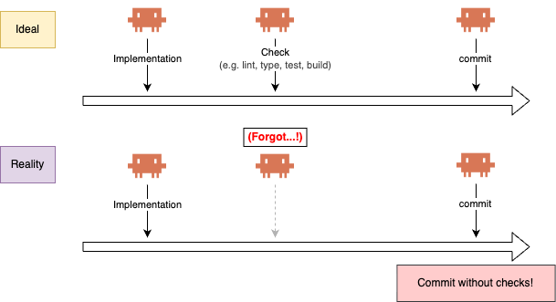
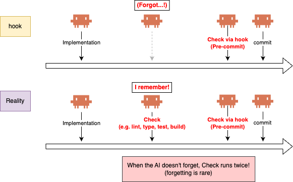
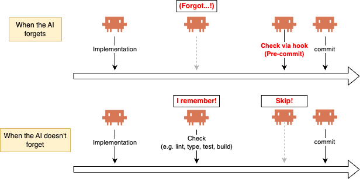

# markgate

A zero-config verification-state cache for hook managers (Claude
Code, husky, lefthook, pre-commit, bare `.git/hooks/*`) that fires
the hook **only when your AI coding agent forgot to run the check
itself** — duplicate runs exit in milliseconds.

## Why this exists

You tell your coding agent to run `/check` (test, lint, build, doc
consistency) before committing. **Sometimes it forgets** — context
loss, token pressure, hurry — and commits anyway.



So you add a pre-commit hook to enforce the check. Now every commit
runs the check twice, once by the agent, once by the hook. Heavy
checks slow the dev loop; light ones still add up.



Pulling the check out of the agent and leaving it only in the hook
isn't the answer — you can't run it before you're ready to commit.
Per-edit hooks aren't either — they pay the cost on every keystroke.

`markgate` resolves the dilemma: keeping both the check site and
the hook in place, **the hook fires only when the agent forgets**.
When the agent ran the check properly, **the hook is skipped** — no
duplicate execution.



Adoption is one line — prefix your check command:

```diff
- pnpm build
+ markgate run -- pnpm build
```

Drop the same line into the hook, and you're done.

## Install

> **Note:** `markgate` is meant to run inside a git repository.

### Homebrew (macOS / Linux)

```sh
brew install go-to-k/tap/markgate
```

### Shell script (macOS / Linux / Windows with Git Bash)

```sh
# Latest
curl -fsSL https://raw.githubusercontent.com/go-to-k/markgate/main/install.sh | bash

# Pin a version
curl -fsSL https://raw.githubusercontent.com/go-to-k/markgate/main/install.sh | bash -s -- v0.1.0
```

### mise

Pin a version per repo via [`.mise.toml`](https://mise.jdx.dev/configuration.html):

```toml
[tools]
"ubi:go-to-k/markgate" = "0.2.0"
```

Or one-shot:

```sh
mise use "ubi:go-to-k/markgate@0.2.0"
```

### `go install`

```sh
go install github.com/go-to-k/markgate/cmd/markgate@latest
```

### Prebuilt binaries

Linux / macOS / Windows archives (amd64 / arm64 / 386) — see
[GitHub Releases](https://github.com/go-to-k/markgate/releases).

## Basic setup

The simplest shape: prefix the check command with `markgate run --`
in **both** the place that runs it and the hook that enforces it —
the same one line goes in both spots.

In your check site (a `/check` skill, build script, Make target, …):

```diff
- pnpm build
+ markgate run -- pnpm build
```

In your Claude Code `PreToolUse` hook on `git commit*`:

```diff
// .claude/settings.json
{
  "hooks": {
    "PreToolUse": [
      {
        "matcher": "Bash",
        "if": "Bash(git commit*)",
        "hooks": [
-         { "type": "command", "command": "pnpm build" }
+         { "type": "command", "command": "markgate run -- pnpm build" }
        ]
      }
    ]
  }
}
```

**That's it.** When the agent already ran the check, the hook is
skipped — duplicate runs exit in milliseconds. When the agent
forgets, the hook runs `pnpm build` itself before the commit goes
through. Either way, `pnpm build` runs at most once per repo state.

For other hook managers (husky, lefthook, pre-commit framework), the
shape is identical — see [Drop into your hook manager](#drop-into-your-hook-manager).

For setups where the hook should **only verify** (the check lives
elsewhere — multi-step script, CI job, separate skill), see
[Gate pattern](#gate-pattern-set--verify).

## Gate pattern: `set` + `verify`

`markgate run -- <cmd>` is the shortest path, but it requires the
hook to know how to run the check. When the check is **multi-step,
lives in a different process, or you want the hook to be a pure
gate**, split `run` into its two halves:

- `markgate set` — record the current state as a marker (after the
  check passes elsewhere)
- `markgate verify` — exit 0 if the marker matches, 1 if not

```sh
# Wherever the check actually runs (skill, build script, CI, Make):
pnpm typecheck
pnpm lint:fix
pnpm build

# Record the pass; markgate's only addition
markgate set
```

Then the hook only verifies the marker:

```json
// .claude/settings.json
{
  "hooks": {
    "PreToolUse": [
      {
        "matcher": "Bash",
        "if": "Bash(git commit*)",
        "hooks": [
          { "type": "command", "command": "markgate verify" }
        ]
      }
    ]
  }
}
```

When this fits better than `run`:

- **Multi-step checks** — with `run`, you'd duplicate the chain
  (typecheck → lint → build → test) in the hook. Split keeps the
  chain in the script; the hook stays a single `markgate verify`.
- **Pure gate hook** — the hook fails fast on un-verified commits
  without running the check itself, handing control back to the
  agent which can re-run the check on its own without further
  prompting.
- **Commit-then-push** — commit hook: `pnpm build && markgate set`;
  push hook: `markgate verify`. Both hooks see the same marker, so
  push skips re-running when nothing has changed since the commit.

## How it works

When `markgate run -- <cmd>` is invoked:

1. It computes a **hash** of the current repo state.
2. If a saved marker matches, `<cmd>` is skipped (exit 0
   immediately).
3. Otherwise `<cmd>` runs. On success, the hash is saved as the new
   marker. On failure, the marker is left untouched.

(For the split shape, `markgate set` writes step 3's marker;
`markgate verify` does step 2's match check.)

```sh
# First run — nothing cached yet, so `pnpm build` runs and the pass is cached.
$ markgate run -- pnpm build
building...
passed in 7.2s

# Second run — nothing changed since the last success: instant skip.
$ markgate run -- pnpm build

# After you edit a file — cache is stale, `pnpm build` runs again.
$ echo '// fix typo' >> src/foo.ts
$ markgate run -- pnpm build
building...
passed in 7.1s
```

The marker is a small JSON file under `.git/markgate/`, one per
gate (the file name matches the gate name, e.g. `default.json`).
Not committed, not tracked, isolated per worktree. With
`--state-dir <dir>`, `MARKGATE_STATE_DIR=<dir>`, or `state_dir:`
in `.markgate.yml`, markers go to `<dir>/` instead — see [Sharing
markers](#sharing-markers-across-machines-ci--teammates). The
on-disk JSON layout is an implementation detail; don't parse it.

## Scoped gates

`markgate` works zero-config — what [Basic setup](#basic-setup)
shows covers most pre-commit cases. When you want finer control,
drop a `.markgate.yml` at the repo root (`markgate init` writes
one):

- **Targeted files** — limit a gate to a specific set of files via
  [`hash: files`](#hashing-strategies-git-tree-vs-files) + `include`
  globs, so unrelated commits don't invalidate the marker
- **Multiple gates** — define independent named gates in one repo,
  each tracking its own scope (e.g. one for pre-commit, one for
  pre-PR)

Combined, these give you **scoped gates**: "re-run this check only
when these files change."

### `.markgate.yml`

Lives at `$(git rev-parse --show-toplevel)/.markgate.yml` (no
parent-dir walking).

`markgate init` writes a starter file at the repo root:

```sh
markgate init          # writes .markgate.yml at the repo root
markgate init --force  # overwrite an existing one
```

The generated file enables the `default` gate with `git-tree` hash,
plus commented-out examples (an `exclude` list on `git-tree` and a
`files`-type gate) — uncomment what you need.

Per-gate fields:

| field | purpose |
| --- | --- |
| `hash` | `git-tree` (default) or `files` |
| `include` | glob list; required for `hash: files` |
| `exclude` | glob list |
| `state_dir` | optional override of marker storage location — see [Sharing markers](#sharing-markers-across-machines-ci--teammates) |

Example:

```yaml
gates:
  default:
    hash: git-tree
    exclude:
      - "vendor/**"
      - "node_modules/**"

  pre-pr:
    hash: files
    include:
      - "docs/**"
      - "README.md"
    exclude:
      - "**/*.txt"
```

Each gate's key (the YAML map key — `default`, `pre-pr` above) must
match `[a-z0-9][a-z0-9-]*` (kebab-case ASCII). `default` is what
`markgate set` / `verify` use when no key argument is given:

```sh
markgate set               # same as `markgate set default`
markgate set pre-pr        # a second, independent gate
```

### Hashing strategies: `git-tree` vs `files`

The `hash` field above picks one of two strategies:

| aspect | `git-tree` (default) | `files` |
| --- | --- | --- |
| What it hashes | `HEAD` + diff-vs-HEAD ∪ untracked-not-ignored | whatever matches your `include` globs |
| `HEAD` in the hash? | **Yes** | **No** |
| Commits invalidate the marker? | Yes | Only if they touch in-scope files |
| `.gitignore` respected? | Yes (automatic) | No — scope is explicit |
| Needs config? | No | Yes (`include` required) |

When to use which:

- **`git-tree`** = "re-verify on *any* repo change". Broad gates
  (pre-commit running lint/test/build). Add `exclude` patterns to
  skip `vendor/`, `node_modules/`, etc. — HEAD-aware invalidation
  is kept.
- **`files`** = "re-verify *only* when these paths change, ignore
  other commits". Narrow gates (docs consistency, vuln scan rooted
  on a lockfile, coverage for one sub-tree).

Rule of thumb: start with `git-tree` (add `exclude` if needed).
Reach for `files` only when you specifically want the "ignore
commits that don't touch these paths" semantics.

## Use cases

Each section follows the same shape: **Scope** (what triggers
re-verify — a [`hash`](#hashing-strategies-git-tree-vs-files)
strategy) → **Commands** (what goes in your shell / hook). All
examples below use scoped `files`-hash gates defined in
[`.markgate.yml`](#markgateyml) at the repo root, and the
[Gate pattern](#gate-pattern-set--verify) shape above. (For the
broad whole-repo `git-tree` shape with no config, see
[Basic setup](#basic-setup).)

### 1. Pre-PR: docs consistency

**Scope**: only `docs/` and `README.md`. Code-only commits don't
invalidate the marker.

```yaml
# .markgate.yml
gates:
  pre-pr:
    hash: files
    include:
      - "docs/**"
      - "README.md"
```

**Commands**:

```sh
./scripts/check-docs && markgate set pre-pr

# Before `gh pr create`:
markgate verify pre-pr || {
  echo "Docs are out of date. Run check-docs." >&2
  exit 1
}
```

### 2. Pre-image-push: vulnerability scan freshness

**Scope**: only files that actually affect the image (Dockerfile +
lockfiles).

```yaml
gates:
  pre-image-push:
    hash: files
    include:
      - "Dockerfile"
      - "package.json"
      - "package-lock.json"
```

**Commands**:

```sh
trivy image ... && markgate set pre-image-push

# In your `docker push` wrapper:
markgate verify pre-image-push || exit 1
```

### 3. Pre-push: coverage report freshness

**Scope**: just source and tests.

```yaml
gates:
  pre-push:
    hash: files
    include:
      - "src/**"
      - "tests/**"
```

**Commands**:

```sh
go test -cover && markgate set pre-push

# In .git/hooks/pre-push:
markgate verify pre-push || exit 1
```

### 4. Pre-commit: isolate a slow check with its own scoped gate

**Scope**: two gates on the same `git commit` event. `check` covers code artifacts; `docs` covers code **and** documentation. Source files appear in both `include` lists on purpose — a src edit invalidates both gates (forcing both checks), while a tests-only edit invalidates only `check` and a docs-only edit invalidates only `docs`.

Useful when one pre-commit check is much slower than the others — typically an LLM-judged "are the docs still consistent with src?" review. Bundling it into the fast code check would force every tests-only or bug-fix commit to pay the doc-review cost. Splitting it into its own scoped gate means each edit only pays for the scope it actually invalidated.

```yaml
# .markgate.yml
gates:
  check:
    hash: files
    include:
      - "src/**"
      - "tests/**"
      - "package.json"
  docs:
    hash: files
    include:
      - "src/**"        # src edits invalidate docs too — see matrix below
      - "docs/**"
      - "README.md"
```

Invalidation matrix:

| edit                         | `check` | `docs` | re-runs needed          |
|------------------------------|---------|--------|-------------------------|
| `tests/**` only              | stale   | fresh  | fast code check only    |
| `docs/**` / `README.md` only | fresh   | stale  | slow docs check only    |
| `src/**`                     | stale   | stale  | both                    |
| outside both scopes          | fresh   | fresh  | neither — commit passes |

The last row is what makes the idiom scale: edits that land in neither `include` list (CI config, editor settings, hook scripts, tooling dotfiles) keep both markers fresh, so a hook verifying both stays silent when nothing relevant moved. That's only possible because each gate owns its own scope — `hash: files` + per-gate `include` is the primitive that makes it work.

**Commands**:

```sh
# Fast code check (src / tests / config):
pnpm typecheck && pnpm lint && pnpm build && markgate set check

# Slow docs consistency check (src / docs / README):
./scripts/check-docs && markgate set docs

# One pre-commit hook verifies both; the failing gate names itself:
markgate verify check || { echo "run the code check" >&2; exit 1; }
markgate verify docs  || { echo "run the docs check" >&2; exit 1; }
```

A working wire-up lives in [go-to-k/cdkd](https://github.com/go-to-k/cdkd):

- [`.markgate.yml`](https://github.com/go-to-k/cdkd/blob/main/.markgate.yml) — gate definitions.
- [`.claude/hooks/check-gate.sh`](https://github.com/go-to-k/cdkd/blob/main/.claude/hooks/check-gate.sh) — pre-commit hook that runs `markgate verify` for each gate.
- [`/check`](https://github.com/go-to-k/cdkd/blob/main/.claude/skills/check/SKILL.md) and [`/check-docs`](https://github.com/go-to-k/cdkd/blob/main/.claude/skills/check-docs/SKILL.md) skills produce the markers (the latter has a diff-based short-circuit to keep the LLM cost low on internal src edits).

## Drop into your hook manager

Substitute `pnpm build` with your verification command. Use
`markgate run --` when the hook itself runs the check, or
`markgate verify` when it sits in front of a separate `markgate set`
(see [Gate pattern](#gate-pattern-set--verify)).

**husky** — `.husky/pre-commit`:

```sh
markgate run -- pnpm build
```

**lefthook** — `lefthook.yml`:

```yaml
pre-commit:
  commands:
    check:
      run: markgate run -- pnpm build
```

**pre-commit framework** — `.pre-commit-config.yaml`:

```yaml
repos:
  - repo: local
    hooks:
      - id: markgate-check
        name: markgate check
        entry: markgate run -- pnpm build
        language: system
        pass_filenames: false
```

**Claude Code (PreToolUse)** — `.claude/settings.json`:

```json
{
  "hooks": {
    "PreToolUse": [
      {
        "matcher": "Bash",
        "if": "Bash(git commit*)",
        "hooks": [
          { "type": "command", "command": "markgate verify" }
        ]
      }
    ]
  }
}
```

In your `/check` skill: `pnpm build && markgate set`. See
[Gate pattern](#gate-pattern-set--verify) for the full flow.

## Command model

### `markgate run -- <cmd>` (one-shot)

Collapses verify → run → set into one invocation (see
[How it works](#how-it-works) for the mechanism). stdio is passed
through; `SIGINT` / `SIGTERM` are forwarded to `<cmd>`. On `<cmd>`
failure, the marker is **not** updated and `<cmd>`'s exit code is
returned as-is.

### `markgate set` / `markgate verify` (split)

The two halves of `run`. See
[Gate pattern](#gate-pattern-set--verify) for when to use the split
shape.

```sh
pnpm build && markgate set    # record state on success
markgate verify || pnpm build # short-circuit if marker fresh, else re-run
```

### Exit codes

Exit codes follow the `grep` / `diff` convention, so `||` composes
naturally:

| exit | meaning                                                   |
| ---- | --------------------------------------------------------- |
| 0    | verified — state matches the marker, safe to skip         |
| 1    | not verified — no marker, or state differs                |
| 2    | error — not in a repo, bad config, bad key, etc.          |

## CLI reference

```text
markgate set    [key]              Record the current state hash.
markgate verify [key]              Exit 0 match, 1 mismatch, 2 error.
markgate status [key]              Show marker + match status.
markgate clear  [key]              Delete the marker (idempotent).
markgate run    [key] -- <cmd>...  Sugar for verify + <cmd> + set.
markgate init                      Write a starter .markgate.yml.
markgate version                   Print the version.
```

### Per-invocation overrides

`set` / `verify` / `status` / `clear` / `run` each accept these flags,
so one-off scopes don't need a `.markgate.yml`:

```text
--hash git-tree|files    Override hash type for this call.
--include <glob>         Repeatable. Override the gate's include list.
--exclude <glob>         Repeatable. Override the gate's exclude list.
--state-dir <path>       Directory to store marker files. Takes
                         precedence over MARKGATE_STATE_DIR env and
                         state_dir: in .markgate.yml. Default:
                         <git-dir>/markgate. See "Sharing markers".
```

Flag syntax is identical across hash types. With `--hash files`,
`--include` is required. Example — exclude `vendor/` without any
config file:

```sh
markgate run --exclude 'vendor/**' -- pnpm build
```

### Environment variables

```text
MARKGATE_STATE_DIR       Marker storage directory. Same effect as
                         --state-dir and state_dir: in config.
                         Precedence: --state-dir > this env >
                         state_dir: in .markgate.yml > default.
```

## Sharing markers across machines (CI / teammates)

By default, markers live under `.git/markgate/` — strictly local. If
that's all you need, skip this section; the [use cases above](#use-cases)
all work with the default.

Read on if you want a check to **skip in CI (or on a teammate's
machine) based on a run that already happened elsewhere**. Typical
wins: coverage, vulnerability scan, e2e, image build — expensive
and deterministic, redundant to re-run. Trust model differs by
pattern (see [Two patterns at a glance](#two-patterns-at-a-glance)
below); pick the one that matches your trust assumptions.

### Specifying a non-default location

Three sources, in precedence order (flag beats env beats config):

```text
--state-dir <dir>           # per-invocation flag
MARKGATE_STATE_DIR=<dir>    # environment variable
state_dir: <dir>            # in .markgate.yml, per gate
```

The marker is written at `<dir>/<key>.json` (no extra `markgate/`
subdirectory). Relative paths resolve against the repo top-level, so
the location is stable regardless of cwd — identical on every machine
that checks out the repo.

### Two patterns at a glance

Both use `--state-dir` / `state_dir`; the difference is whether the
marker is **committed** to the repo.

| aspect | **A. Not committed** (CI cache / artifact) | **B. Committed** |
| --- | --- | --- |
| Marker in the repo? | No (typically gitignored, or outside the repo) | Yes, tracked in git |
| Works with hash type | `git-tree` or `files` | **`files` only** — committing with `git-tree` breaks: the commit changes HEAD → digest is instantly stale |
| Local → CI sharing | Needs CI cache / artifact / shared volume | Just `git push` |
| Tamper surface | Whoever can write to the cache | Whoever has commit access |
| Extra infra | CI cache provider (e.g. `actions/cache`, `actions/upload-artifact`) | None — git is enough |
| Best for | CI-internal reuse across runs; teams already on remote cache infra | Zero-infra local→CI sharing for `files`-hash gates (coverage, scans) |

### A. Not committed (CI cache / artifact)

Store the marker somewhere CI can pick it up, but keep it out of git.
`.markgate-cache/` at the repo root is a conventional choice; any
path outside `.git/` works. (If you'd rather commit the marker into
git so CI sees it without any cache layer, skip to
[Pattern B](#b-committed-files-hash) — that's a different shape, not
a variant of this one.)

#### Step 1. Add the state dir to `.gitignore`

**This is a required setup step on `hash: git-tree`, not optional
hygiene.** Do this *before* your first `markgate run`:

```gitignore
# .gitignore — add the state dir you chose
/.markgate-cache/
```

You can skip this only if:

- the state dir is **outside the repo** (e.g. `$RUNNER_TEMP/mg`,
  `/tmp/mg`, `$HOME/.cache/markgate`), **or**
- you're on `hash: files` (gitignore then becomes hygiene, not
  required — see why below).

<details>
<summary>Why it's required on <code>hash: git-tree</code> (click to expand)</summary>

The `git-tree` digest hashes `HEAD + diff-vs-HEAD ∪
untracked-not-ignored`. The saved marker file is itself an untracked
file, so without gitignore:

1. `markgate run` computes **digest_1** (before the marker exists)
   and saves the marker with digest_1.
2. The saved marker file now exists as untracked-not-ignored.
3. The next `markgate verify` computes **digest_2**, which *includes*
   the marker file. digest_2 ≠ digest_1 → mismatch → the check
   re-runs every time.

The feature is defeated on the first verify, before any commit.
Gitignoring the state dir keeps the marker out of the digest.

`hash: files` sidesteps this: the marker is only in the digest if an
`include` glob matches it, which it normally won't. That's why
gitignore is optional on `files`.

</details>

#### Step 2. Wire up CI

**Across runs of the same workflow** — `actions/cache`, extending
the `pre-image-push` gate from [Use case 2](#2-pre-image-push-vulnerability-scan-freshness):

```yaml
# .github/workflows/scan.yml
jobs:
  scan:
    steps:
      - uses: actions/checkout@v4
      - uses: actions/cache@v4
        with:
          path: .markgate-cache
          key: markgate-scan-${{ github.sha }}
          restore-keys: |
            markgate-scan-
      - run: markgate run pre-image-push --state-dir .markgate-cache -- trivy fs .
```

**Across jobs within one workflow** — `actions/upload-artifact` →
`actions/download-artifact`. A setup job runs the expensive check
once; matrix jobs on the same commit download the marker and skip.
(`expensive` below is a placeholder key — define it in your
`.markgate.yml` using the [Use cases](#use-cases) as templates, or
pass `--include` / `--hash` via CLI flags.)

```yaml
jobs:
  verify:
    steps:
      - uses: actions/checkout@v4
      - run: markgate run expensive --state-dir .markgate-cache -- make expensive-check
      - uses: actions/upload-artifact@v4
        with:
          name: markgate-state
          path: .markgate-cache

  fan-out:
    needs: verify
    strategy:
      matrix:
        os: [ubuntu-latest, macos-latest, windows-latest]
    runs-on: ${{ matrix.os }}
    steps:
      - uses: actions/checkout@v4
      - uses: actions/download-artifact@v4
        with:
          name: markgate-state
          path: .markgate-cache
      - run: markgate verify expensive --state-dir .markgate-cache || make expensive-check
```

### B. Committed (files hash)

Keep the state directory **tracked in git** and commit the marker with
the code. Works only with `hash: files`: `git-tree` would change HEAD
on the commit and invalidate the marker it just wrote.

Typical fit: coverage reports, image vulnerability scans — expensive,
deterministic, and already re-running them on every push is waste
when nothing in scope changed.

Coverage example, extending the pre-push gate from [Use case 3](#3-pre-push-coverage-report-freshness):

```yaml
# .markgate.yml
gates:
  coverage:
    hash: files
    include:
      - "src/**"
      - "tests/**"
    state_dir: .markgate-state
```

```sh
# Locally, after a successful coverage run:
markgate run coverage -- go test -cover ./...
git add .markgate-state/coverage.json
git commit -m "bump coverage marker"
git push

# In CI (already sees the committed marker):
markgate verify coverage || go test -cover ./...
```

Trust model: anyone with commit access can forge a skip. Use committed
markers where commit-access already implies trust in the signal.

### Caveats

- **Worktree isolation is lost** when the dir is shared across
  worktrees pointing at the same location. The default `.git/`-based
  layout preserves isolation; `--state-dir` does not.
- **Relative paths** resolve from the repo top-level, not cwd, so
  hook-invoked commands land in the same place regardless of where
  they run from.
- **Signing is not yet implemented** — markers are unsigned JSON.
  Tamper resistance depends on who can write to the directory (cache /
  repo).

## FAQ

- **Why not just `git status` in the hook?** `git status` tells you
  the tree is clean, not "did the check pass against this exact
  state." `markgate` records the success itself, so a passed check
  stays valid across hook invocations until something moves.
- **Does it work in git worktrees?** Yes. Markers live under each
  worktree's own `.git/` dir, so they don't leak across worktrees.
  (This isolation is lost if you point `--state-dir` at a shared
  location.)
- **Do I need to gitignore anything?** No for the default layout —
  markers are under `.git/`. If you use `--state-dir` pointing inside
  the repo, gitignore that directory.
- **What if I don't want HEAD in the hash?** Use
  [`hash: files`](#hashing-strategies-git-tree-vs-files) for that
  gate.
- **Does `files` respect `.gitignore`?** No. `files` is explicit
  scope by design. Use `git-tree` when you want `.gitignore`-aware
  behavior. (See [Hashing strategies](#hashing-strategies-git-tree-vs-files).)
- **Can markers be shared across machines / CI?** Yes, via
  `--state-dir`, `MARKGATE_STATE_DIR`, or `state_dir:` in
  `.markgate.yml`. See
  [Sharing markers](#sharing-markers-across-machines-ci--teammates) for patterns
  and trust considerations.
- **Can the marker be tampered with?** Yes — it's a JSON file under
  `.git/` (or wherever `--state-dir` points). Trust whoever can write
  to that location. Signed markers are still a future consideration.

## License

MIT. See [LICENSE](LICENSE).
